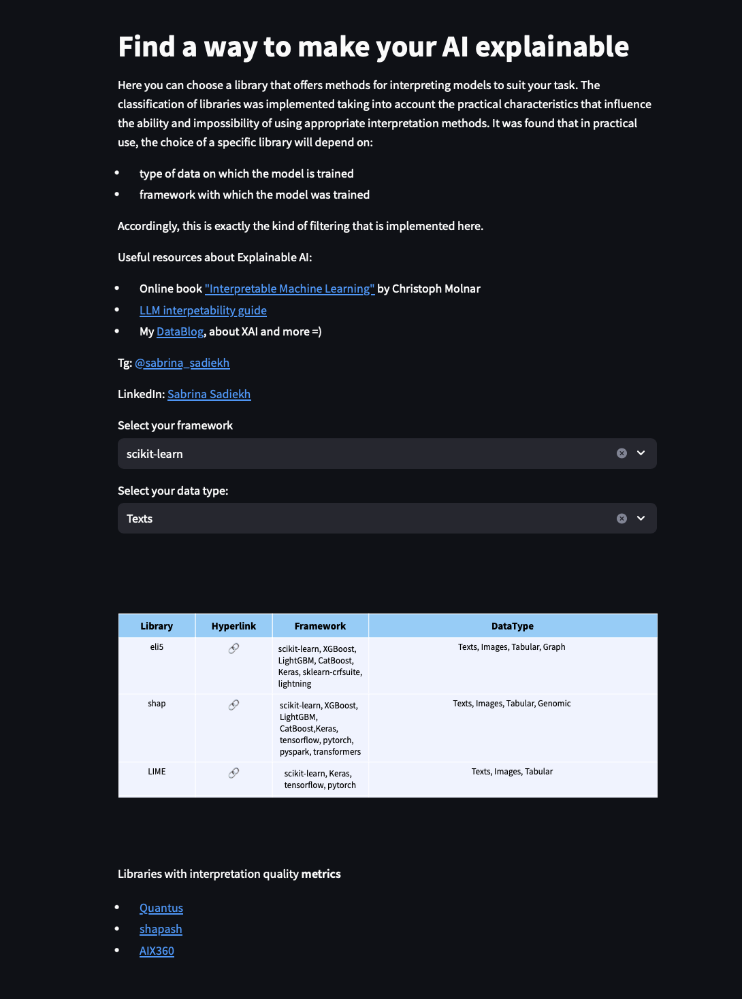

# Find a way to make your AI explainable

Here you can find a library offering model interpretation methods tailored to your needs. The classification of libraries was implemented considering practical characteristics that influence the feasibility of using specific interpretation methods. It was found that, in practice, the choice of a particular library depends on:

- The type of data the model was trained on
- The framework used to train the model

Accordingly, this filtering is implemented here.

## About the Project

The project aims to assist developers and researchers in selecting appropriate tools for interpreting machine learning models. We provide a convenient interface for filtering and choosing libraries based on your requirements and conditions.

## Key Features

- **Data Type**: Filter libraries based on the type of data (tabular data, images, text, etc.) you are working with.
- **Framework**: Support for popular frameworks such as TensorFlow, PyTorch, scikit-learn, and others.

## Useful Resources on Explainable AI

- **E-book ["Interpretable Machine Learning"](https://christophm.github.io/interpretable-ml-book/)**: Author Christoph Molnar.
- **[Guide to Interpretability for LLM](https://github.com/JShollaj/awesome-llm-interpretability)**: A guide to understanding and applying interpretation methods for large language models.
- **My [DataBlog](https://t.me/jdata_blog)**: Articles and notes on Explainable AI (XAI) and other topics in Data Science.

## Contacts

- **Telegram**: [@sabrina_sadiekh](https://t.me/sabrina_sadiekh)
- **LinkedIn**: [Sabrina Sadiekh](https://www.linkedin.com/in/sabrina-sadiekh)

## Installation

To install and use this project, follow these steps:

1. Clone the repository:
   ```bash
   git clone https://github.com/SadSabrina/streamlit_XAI_table.git
   ```
2. Navigate to the project directory:
   ```bash
   cd streamlit_XAI_table
   ```
3. Install dependencies:
   ```bash
   pip install -r requirements.txt
   ```

## Usage

Simply select the required framework and data type.



## Contribution

We welcome contributions to the project! If you would like to suggest improvements or add new features, please create a pull request or open an issue.

## License

This project is licensed under the MIT License. See the LICENSE file for details.

---

**Author**: Sabrina Sadiekh  
**Creation Date**: July 2024

---

Thank you for using our tool to search and select Explainable AI libraries!